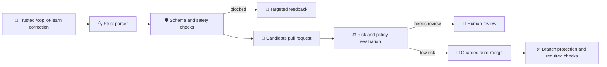

# Self-correcting Copilot instructions

_Turn explicit maintainer corrections into reviewed, auditable updates to your repository instructions._

## Welcome

Repository instructions drift. A maintainer explains the same correction in review over and over, and nothing durable changes. This exercise fixes that with a governed pipeline: a trusted maintainer submits one explicit `/copilot-learn` correction, and automation converts it into a validated pull request against `.github/copilot-instructions.md` that a human reviews and merges.

- **Who is this for**: Developers, maintainers, and platform engineers comfortable with GitHub Actions and JavaScript.
- **What you'll learn**:
  - How to trust actor identity rather than labels or wording.
  - How to treat comment text as untrusted data that never reaches a shell.
  - How to validate proposed changes against a closed schema with provenance and fingerprints.
  - How to manage a rule lifecycle without erasing history.
  - How to classify risk deterministically and automate only what you can prove is safe.
- **What you'll build**: A secure, deterministic pipeline that proposes instruction updates as reviewable pull requests, blocks unsafe corrections, and queues only low-risk candidates for guarded auto-merge.
- **Prerequisites**: Familiarity with [GitHub Actions](https://docs.github.com/en/actions) and pull request reviews. [Node.js 20](https://nodejs.org) if you want to run the checks locally.
- **How long**: 45-60 minutes across two lessons.

In this exercise, you will:

1. Configure trusted actors and explicit correction signals
2. Complete the candidate schema
3. Parse a strict `/copilot-learn` command
4. Generate an instruction-update pull request
5. Block unsafe candidates
6. Review and merge the candidate
7. Supersede or revoke a rule
8. Configure deterministic low-risk policy
9. Enable guarded pull request auto-merge
10. Verify safe and unsafe fixtures

> [!IMPORTANT]
> This exercise automates **repository instructions**. It does not train GitHub Copilot and it does not make Copilot self-learning. See [`docs/platform-boundary.md`](docs/platform-boundary.md) for exactly where that line sits.

### How to start this exercise

Simply copy the exercise to your account, then give your favorite Octocat (Mona) **about 20 seconds** to prepare the first lesson, then **refresh the page**.

[](https://github.com/new?template_owner=abelberhane&template_name=self-correcting-copilot-instructions&owner=%40me&name=skills-self-correcting-copilot-instructions&description=Exercise%3A+Self-correcting+Copilot+instructions&visibility=public)

<details>
<summary>Having trouble? 🤷</summary><br/>

When copying the exercise, we recommend the following settings:

- For owner, choose your personal account or an organization to host the repository.
- Create a **public** repository. Private repositories [use Actions minutes](https://docs.github.com/en/billing/managing-billing-for-github-actions/about-billing-for-github-actions), and auto-merge in Lesson 2 is unavailable on private repositories using the GitHub Free plan.

If the exercise isn't ready in 20 seconds:

1. After your new repository is created, wait about 20 seconds, then refresh the page.
2. Follow the step-by-step instructions in the issue created in your repository.
3. If the page doesn't refresh automatically, please check the [Actions](../../actions) tab.
   - Check to see if a job is running. Sometimes it simply takes a bit longer.
   - If the page shows a failed job, please submit an issue. Nice, you found a bug! 🐛

Two repository settings are configured during the exercise itself, so you do not need them up front:

- **Step 4** turns on read and write workflow permissions so Actions can open the candidate pull request.
- **Step 9** requires the evaluator status check and turns on auto-merge.

</details>

## How the pipeline works



`.github/copilot-instructions.md` has two sections. Automation may never touch the maintainer-controlled section, and may only extend the learned-rules section between its boundary markers. Every learned rule carries a stable ID, category, lifecycle state, provenance, and fingerprint.

## Lessons and steps

### Lesson 1 · Governed corrections (steps 1-7)

Turn a trusted maintainer correction into a reviewed instruction pull request.

| Step | Title | What you will do |
|---:|---|---|
| 1 | Configure trusted actors and explicit signals | Decide who may submit corrections, and require the exact `/copilot-learn` signal on a Copilot-associated pull request |
| 2 | Complete the candidate schema | Define the closed data shape for a rule: stable ID, category, lifecycle state, provenance, and fingerprint |
| 3 | Parse a strict command | Read the comment as untrusted data, accept only documented fields, and reject malformed or unknown input |
| 4 | Generate an instruction-update PR | Render the rule inside the learned-rules boundary, write audit records, and open a candidate pull request |
| 5 | Block unsafe candidates | Reject secrets, prompt injection, duplicates, contradictions, overfitting, and governance changes |
| 6 | Review and merge the candidate | Inspect the diff, provenance, and audit trail, then merge the candidate after checks pass |
| 7 | Supersede or revoke a rule | Retire a rule without deleting history by transitioning it to superseded or revoked |

### Lesson 2 · Guarded automation (steps 8-10)

Let only provably low-risk candidates merge automatically, without weakening protections.

| Step | Title | What you will do |
|---:|---|---|
| 8 | Configure deterministic low-risk policy | Set deterministic rules for risk, allowed paths, blocked categories, and required labels and checks |
| 9 | Enable guarded PR auto-merge | Queue only policy-qualified pull requests with native auto-merge, never bypassing required checks |
| 10 | Verify safe and unsafe fixtures | Prove the valid correction passes and every unsafe fixture is still blocked |

## Run the checks locally

The whole pipeline is deterministic. No model API, external service, or secret is required.

```bash
npm ci
npm test        # unit tests over valid and unsafe fixtures
npm run validate  # repository structure and workflow safety
npm run simulate  # print the candidate a correction would produce
```

## Reset or retry

Only one step workflow is enabled at a time: each step disables itself and enables the next one when it passes. Re-run a failed step from the **Actions** tab after applying its feedback. To restart the exercise, close the exercise issue, revert learner changes, then enable and run **Step 0**. Candidate branches and audit entries are append-only history, so revoke or supersede rules instead of deleting that history.

> [!IMPORTANT]
> Auto-merge uses GitHub's native auto-merge capability. It waits for branch protection and required checks, and never pushes to the default branch or bypasses protections.

## Documentation

| Document | Contents |
| --- | --- |
| [`docs/architecture.md`](docs/architecture.md) | Pipeline components and data flow |
| [`docs/threat-model.md`](docs/threat-model.md) | Each control mapped to the risk it mitigates |
| [`docs/platform-boundary.md`](docs/platform-boundary.md) | What this automates, and what it explicitly does not |
| [`docs/rollback.md`](docs/rollback.md) | Reverting a merged rule and reading the audit trail |
| [`docs/troubleshooting.md`](docs/troubleshooting.md) | Common exercise and workflow failures |

---

Licensed under the [MIT License](LICENSE).
